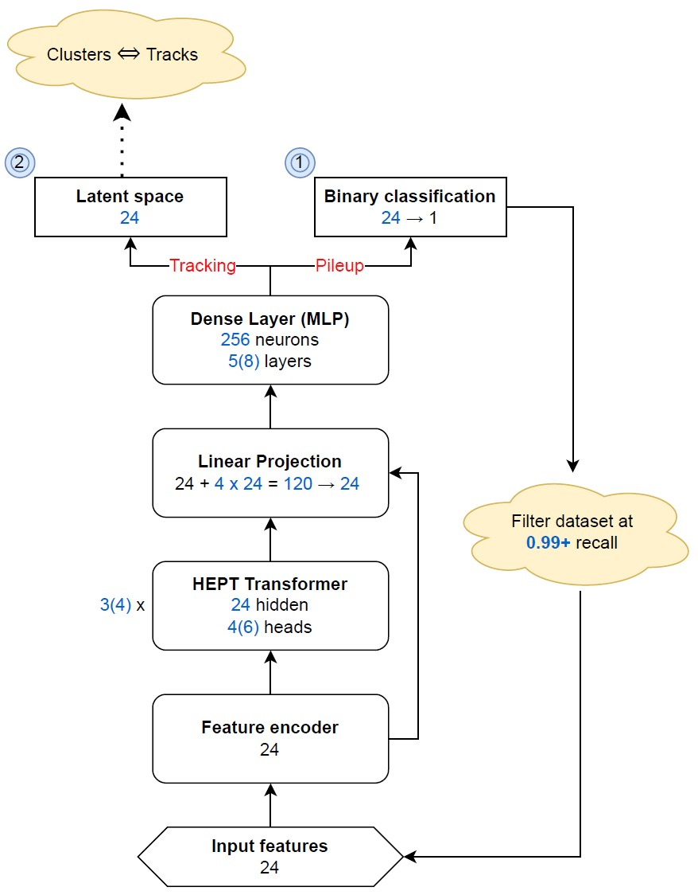

# HEPT-CMS
Implementation of HEPT efficient transformer model utilizing LSH (https://arxiv.org/abs/2402.12535) for high pileup CMS data. Transformer/efficient attention and hashing code was adapted from Siqi Miao's repo: https://github.com/Graph-COM/HEPT, who is one of the authors on the paper.

Currently set up to run tracking and pileup tasks using **LST line segment (LS)** features.
- **Pileup** model does binary classification on LS using `LS_isFake` branch as labels.
- **Tracking** model outputs 24D learned embedding space where true LS from the same sim track (`LS_SimTrkIdx` branch) are clustered together, with no additional post-processing.

See [slides](https://github.com/evgueni-alexeev/HEPT-CMS/blob/main/HEPT%20implementation%20for%20CMS.pdf) for some info.

### Dataset construction

Raw event data is generated from pileup 50, 100 or 200 ntuple (not included in repo due to size, see below for uaf paths) via `data/process_ntuple.py` and saved as `graph_#.pt` files. There are a few raw events included in the repo for illustrative purposes (not enough for proper training). To generate the combined dataset from those event files, run
```
python dataset.py -d <task> -pu <pileup density> ...
```
with `<task> = pileup` or `tracking`, and `<pileup density> = {50,100,200}`. Use `-t <N>` command to only use first N events in the correspoding raw folder (will generate dataset with all events in raw by default).

Tracking dataset construction is the same as pileup, with additional LS-LS edges built for contrastive learning (used during training only). Edges are built using `torch_geometric.nn.radius_graph` in LDA-transformed 3D coordinate space which attempt to cluster line segments from the same track closer together, and away from other tracks and noise points. Using LDA coords instead of e.g. $\eta$ and $\phi$ massively reduces the radius and k hyperparameters required to saturate each sim track cluster.

After pileup model is trained, it can be used to generate a filtered tracking dataset at some recall threshold (default: 0.99), by running the `dataset.py` script for 'tracking' task with `-f` flag: 
```
python dataset.py -d tracking -t ... -pu ... -f -ckpt <checkpoint_folder>
```
This will save a filtered dataset to `data/processed/tracking/pu<..>` with auxiliary edges, to be used for final training.

The ttbar ntuples are available here on the t2 uaf server:

pu200 (7000 events)
```
/ceph/cms/store/user/aaarora/LSTrkIdxRelVal_PU200RelVal_NEVT-1__LSTNtuple.root
```
pu100 (2x1000 events)
```
/ceph/users/atuna/CMSSW_15_1_0_pre2/src/RecoTracker/LSTCore/standalone/LSTNtuple.ttbarPU100.0.root
/ceph/users/atuna/CMSSW_15_1_0_pre2/src/RecoTracker/LSTCore/standalone/LSTNtuple.ttbarPU100.1.root
```
pu50 (2x1000 events)
```
/ceph/users/atuna/CMSSW_15_1_0_pre2/src/RecoTracker/LSTCore/standalone/LSTNtuple.ttbarPU050.0.root
/ceph/users/atuna/CMSSW_15_1_0_pre2/src/RecoTracker/LSTCore/standalone/LSTNtuple.ttbarPU050.1.root
```

### Training

Model training and inference is done with `PyTorch Lightning`, supporting both cpu, and single/multi-gpu (via `FSDP`) setups. Training settings and model hyperparameters are controlled through `cfg_pileup.yaml` and `cfg_tracking.yaml`, which use mostly the same parameters. To train the model, run
```
python trainer.py -p
```
or
```
python trainer.py -t
```
for pileup and tracking respectively.

For pileup, Focal Loss (https://paperswithcode.com/method/focal-loss) is used, with emphasis on maximizing precision at high recall (0.99 to 0.999). The pileup dataset (especially pu200) is highly imbalanced, and we find better performance using both $\gamma \sim 2$ and an overtuned (2x) imbalance ratio in the loss function, calculated separately for each event, which helps prioritize the true LS and focus on high recall.

For tracking, InfoNCE (https://arxiv.org/pdf/1807.03748.pdf) is used on the $M$ auxiliary LS-LS edges, which are generated by looping over all the *real* LS and connecting them to up to $k_{max}$ nearest neighbors within some Euclidean radius $r$. An edge connecting a LS to another LS with the same sim track id is classified as 'positive', and contrasted with the other $M-1$ 'negative' edges from that LS. Fake/noise points that are caught in each $r$-sized bubble are assigned a fake negative 'track id'. They contribute to the N-1 set of negative examples in the loss function, and the model learns to push them away from the real clusters during training.

### Evaluation

Logs (metrics, plots) from the training run will be saved in `logs/<task>/csv/version_XX/`, with optional tensorboard output in `tb` folder. The model also saves the best val metric, best val loss and last epoch checkpoints during training.

- Pileup outputs include F-score ($F_1$ and $F_\beta$, usually with $\beta = 3$), the Precision-Recall Curve and AUPRC
- Tracking outputs the (mean) Average Precision @ k: AP@k = $\frac{1}{N}\sum_{i=1}^{N}$ Prec @ $k_i$ i.e. for each LS, find the sim track index and check how many of its k = 1, 2, ..., L-1 nearest neighbors (L = track length) in the latent space belong to the same sim track, and average across k and across all LS. Note this is ideologically similar to efficiency, but goes point by point rather than track by track. AP@k is calculated for 3 thresholds: $p_t \geq \{0, 0.5, 0,9\}$ GeV.

There is some post-processing done after the training loop to generate the plots and fix the output files `metrics.csv`. For early stopping during training, if those outputs are needed/important, create a blank "STOP" file in the root dir (e.g. `touch STOP' in bash) and the program will exit the training loop gracefully and still generate plots/post-processing.

`eval/filter_model.py` can be used to apply a trained pileup model on a dataset to produce filtered versions at various recall thresholds, those will be saved in `eval/pileup/<saved_model>/filtered_data`. The filtered(or unfiltered) datasets can also be analyzed using a trained tracking model via `eval/tracking_eval.py`. This gives a detailed breakdown of efficiency and analysis by track length, $p_t$, etc when applied on a partially cleaned dataset. The same analysis can be run on just the sim-matched line segments in the dataset (which masks out `LS_isFake` points).

There are currently 2 pre-trained models saved in `eval`, both trained on 2000 events from the pu200 ntuple, on a single A40 over ~200 epochs. The pileup model achieved a **40.9% precision** at 99% recall, and **96.5% AUPRC**. The tracking model built using the 99% recall threshold, with $r=0.15$ and $k \sim 30$ achieved a **94.1% mean AP** score and an estimated **94% LHC efficiency** @ $p_t \geq 0.9$ GeV. The efficiency was calculated using a separate sample of 10 events (not in the training/validation set), for clusters with 5 or more line segments.

### Architecture


